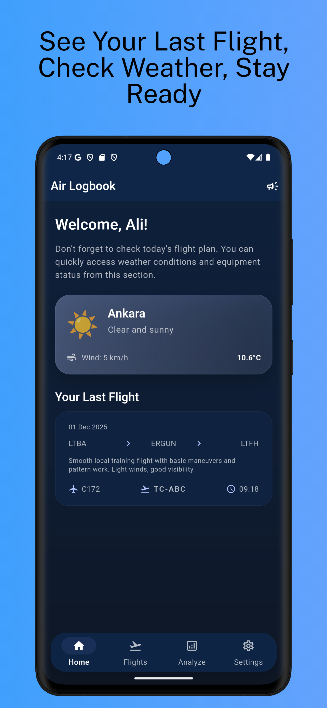
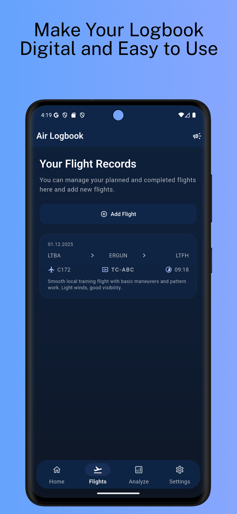
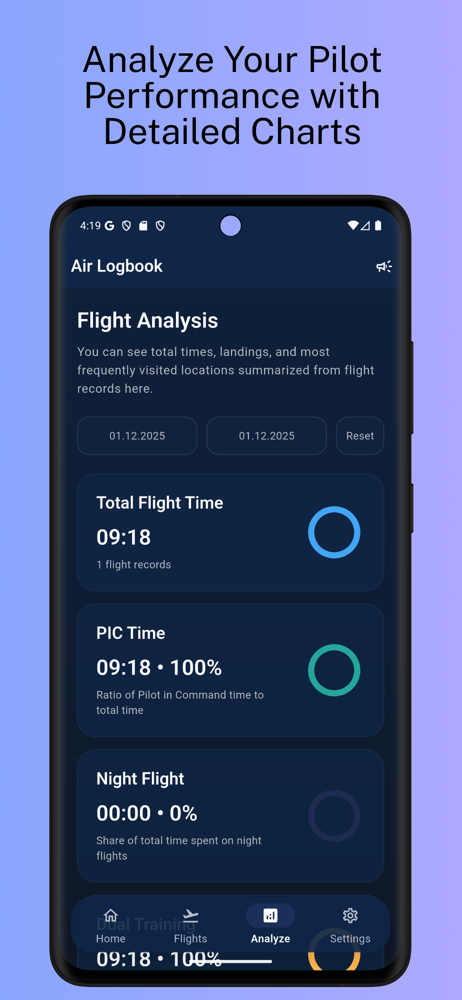
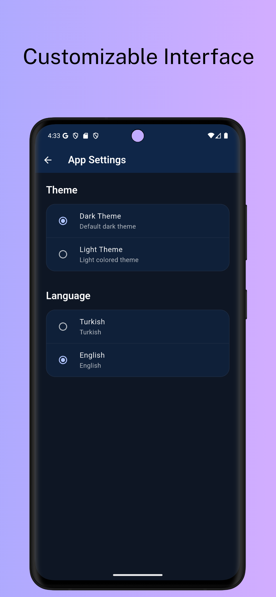
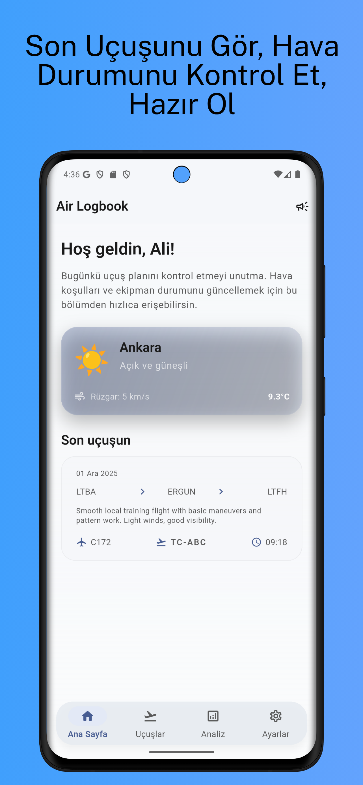
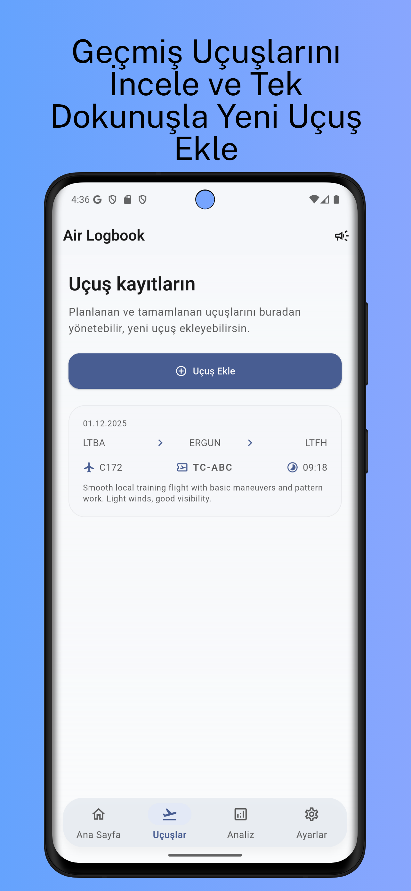
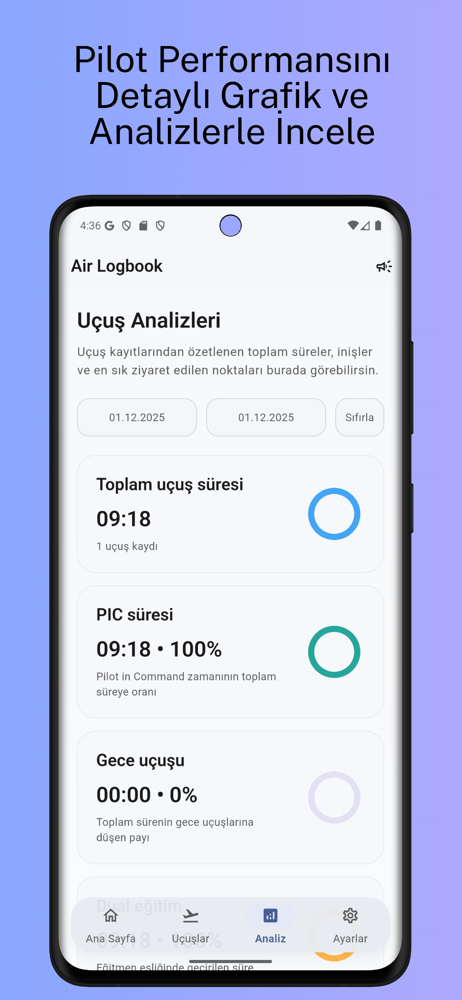
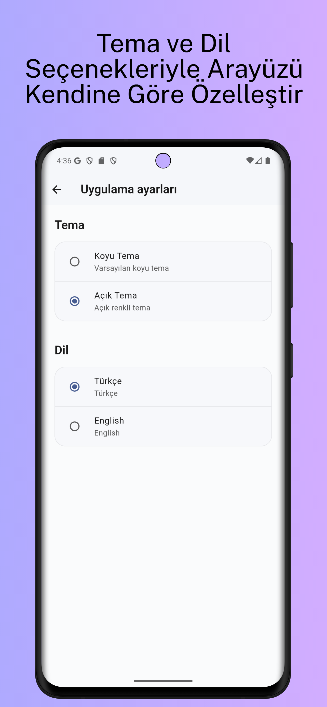

# ✈️ Air Log Book

**Air Log Book** is a modern mobile application developed for pilots to digitally record, manage, and track their flight logs in a secure and organized way.

---

## 📸 App Screenshots (EN)

  
  
  
  

---

## 🇬🇧 Description

### 🧭 About the App
Air Log Book is designed to help pilots keep accurate and accessible flight records without relying on physical logbooks.  
The app focuses on simplicity, reliability, and compliance with modern digital aviation needs.

### ✨ Key Features
- 📘 Digital flight log recording
- ⏱️ Flight time tracking
- 👤 Pilot profile management
- 📱 Clean, fast, and mobile-friendly interface
- 🔐 Privacy-focused data handling

### 🔐 Privacy & Data Protection
User privacy is a top priority.

- Privacy Policy:  
  📄 [`privacy_policy.txt`](privacy_policy.txt)
- Account Deletion Guide:  
  📄 [`delete_account_guide.txt`](delete_account_guide.txt)

---

## 📸 Uygulama Görselleri (TR)

  
  
  
  

---

## 🇹🇷 Açıklama

### 🧭 Uygulama Hakkında
Air Log Book, pilotların uçuş kayıtlarını dijital ortamda güvenli ve düzenli bir şekilde tutabilmeleri için geliştirilmiş bir mobil uygulamadır.  
Fiziksel logbook kullanımına ihtiyaç duymadan uçuş verilerinin kayıt altına alınmasını sağlar.

### ✨ Öne Çıkan Özellikler
- 📘 Dijital uçuş log kaydı
- ⏱️ Uçuş saatlerinin takibi
- 👤 Pilot profil yönetimi
- 📱 Sade, hızlı ve mobil uyumlu arayüz
- 🔐 Gizliliği esas alan veri yönetimi

### 🔐 Gizlilik ve Veri Güvenliği
Kullanıcı gizliliği önceliklidir.

- Gizlilik Politikası:  
  📄 [`privacy_policy.txt`](privacy_policy.txt)
- Hesap Silme Rehberi:  
  📄 [`delete_account_guide.txt`](delete_account_guide.txt)

---

## 🎯 Target Audience / Hedef Kitle
- Student pilots
- Private pilots
- Commercial pilots
- Aviation professionals who need a reliable digital logbook

---

## 📱 Platforms
- Android
- iOS

---

## ℹ️ Repository Purpose
This repository is used to:
- Provide official application documentation
- Share privacy and account deletion policies
- Support Google Play & App Store compliance

> Application source code is not publicly shared.

---

## 📬 Support
For support or inquiries, please use the contact information provided in the app stores.

---

**Developed by Ali Murat Kalaycı**
